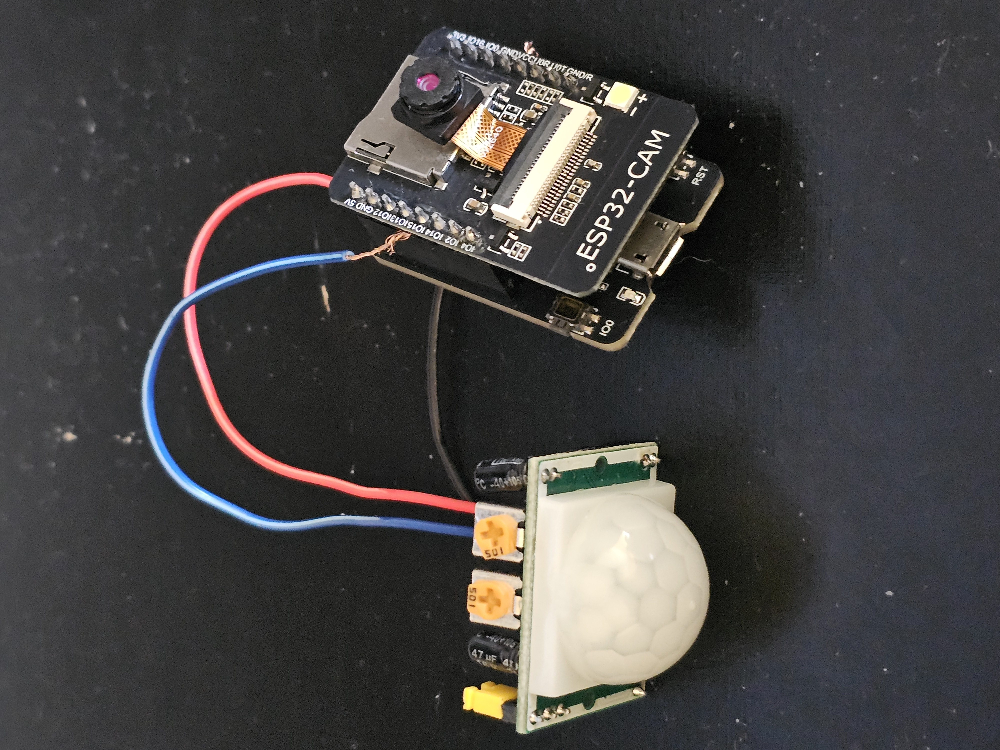
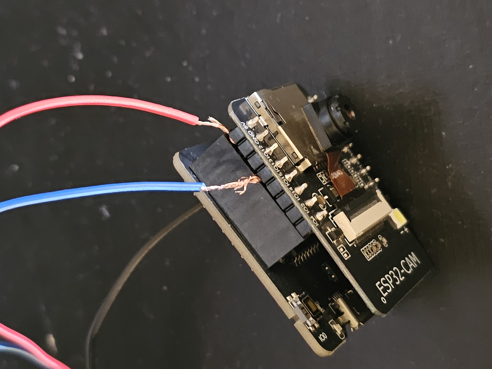
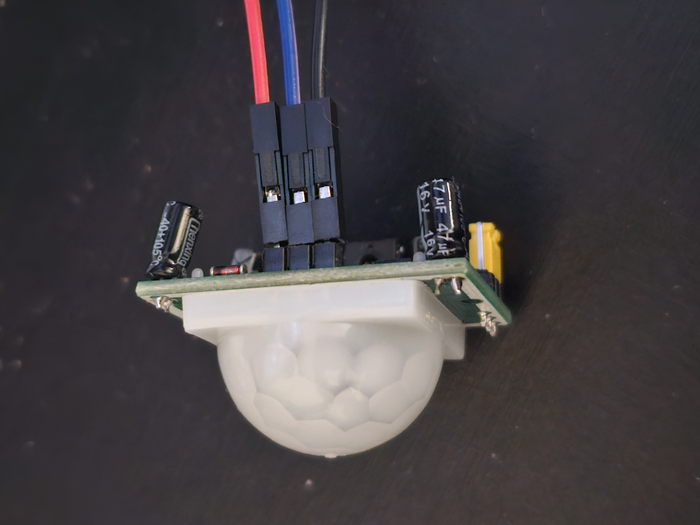

# Anotações & Progresso do Projeto

> [!NOTE]
> Aqui terá toda as informações de como foi desenvolvido o projeto IoT - Reconhecimento facial do meu TCC

[08/02/2026 - domingo]: Ontem (07/02/2026) sábado chegou o último dispositivo, o ESP32-CAM. hoje vamos dar iniciativa nas pesquisas sobre todos os dispositivos para entender melhor para que serve e como devo conectá-los e programá-los.

**Padrão de perguntas para cada componente:**

1. Oque é?
2. Oque cada parte do componente é?
3. Para que serve? (sua utilidade):
4. Onde deve ser usado?
5. Quais outros componentes são compatíveis com (nome_dispositivo)?

**perguntas globais**

- Onde deve ser programado (IDE)?
- Posso ser usado outra linguagem e depois compilar para a original (exemplo de pythop para arduino)?

### O que fiz hoje

1. Encontrei um site para simular meus dipositivos chamado [wokwi.](https://wokwi.com/)
2. Entrei nesse [vídeo](https://www.youtube.com/watch?v=mdaM53qIYgk&t=78s) e segui o tutorial. (não compactua com o escopo do meu projeto)
3. Imagem do sensor pir

4. até o momento percebi que o meu MB serve para passar os codigos e vou fazer as conexão de tudo feito depois porem ainda não entendi como fazer isso, vou deixar para o próximo dia

horário do termino: 20:26

--------

[09/02/2026 - segunda]:

1. Conectei o dispositivo ao PC (após 1 hora de tentativas).
2. Realizei o teste inicial na placa **ESP32-CAM-MB** subindo um código para alternar o LED embutido a cada 2 segundos.
3. Configurei o **ESP32-CAM** na rede local utilizando o exemplo `CameraWebServer`.
4. Obtive imagens em tempo real acessando o IP local do dispositivo.

--------

[10/02/2026 - terça]:

### Resumo

Hoje, às 17:17, tive um resultado acima do esperado: consegui fazer com que o dispositivo capturasse uma foto ao detectar movimento pelo **sensor PIR** e a enviasse automaticamente para o **Telegram**, por meio do bot `SecurityHomeJX_bot` (criado também hoje).

> [!NOTE]
> Isso representa um grande avanço, pois antes eu já estava considerando comprar equipamentos adicionais para concluir o projeto sem passar pela etapa de prototipagem.

### O que fiz

1. Preparei 3 fios (vermelho, azul e preto), cortando uma das pontas de cada um para expor o cobre.
2. Conectei os fios ao **Sensor PIR** conforme a tabela abaixo.
3. Conectei a outra extremidade dos fios (lado intacto) ao **ESP32-CAM-MB**.
4. Criei o bot `SecurityHomeJX_bot` no Telegram para receber as fotos capturadas.

### Conexões

#### Sensor PIR → Fios

| Pino do Sensor | Fio         |
| :---:          | :---:       |
| ***VCC***      | Vermelho    |
| ***OUT***      | Azul        |
| ***GND***      | Preto       |

#### ESP32-CAM-MB → Fios

| Pino da Placa  | Sinal (Fio) |
| :---:          | :---:       |
| ***5V***       | VCC (Vermelho) |
| ***GND***      | GND (Preto)    |
| ***GPIO 13***  | OUT (Azul)     |

> A montagem ficou no estilo "sanduíche" — uma gambiarra criativa com os componentes disponíveis. 🛠️

### Protótipo Final

| Protótipo - Final | ESP32-CAM e ESP32-CAM-MB (adaptado) | Sensor PIR (adaptado) |
| :---: | :---: | :---: |
|  |  |  |

--------

[11/02/2026 - quarta]:

--------

[12/02/2026 - quinta]:

--------

[13/02/2026 - sexta]:

--------

[14/02/2026 - sábado]:

--------

