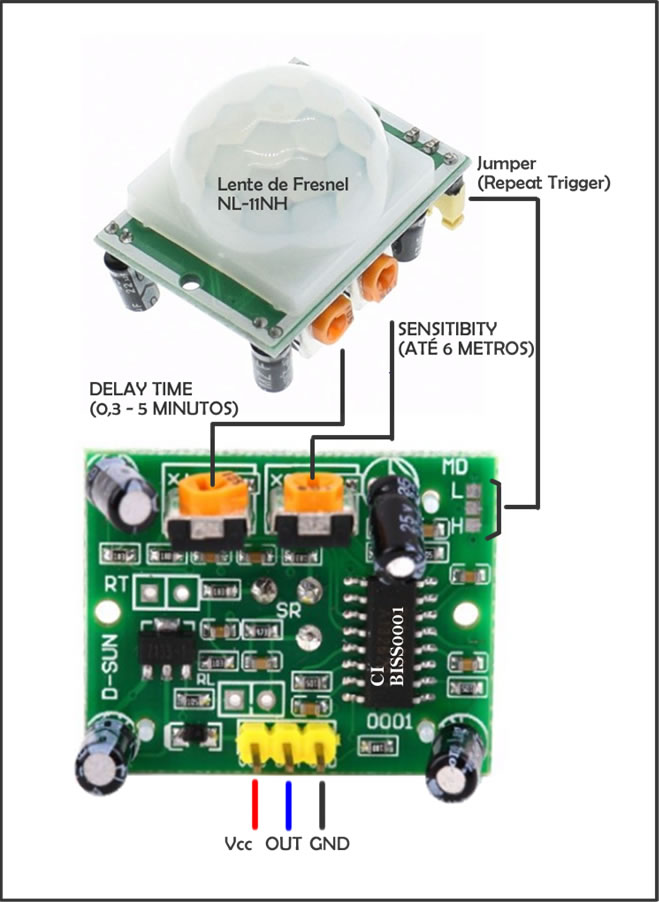
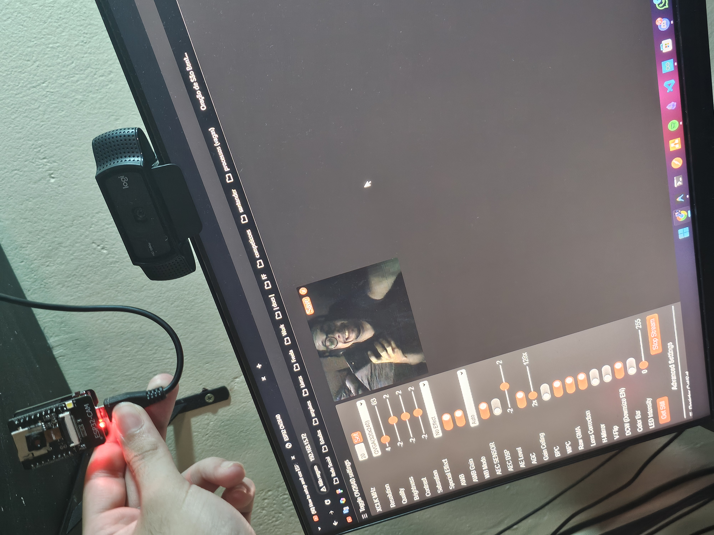
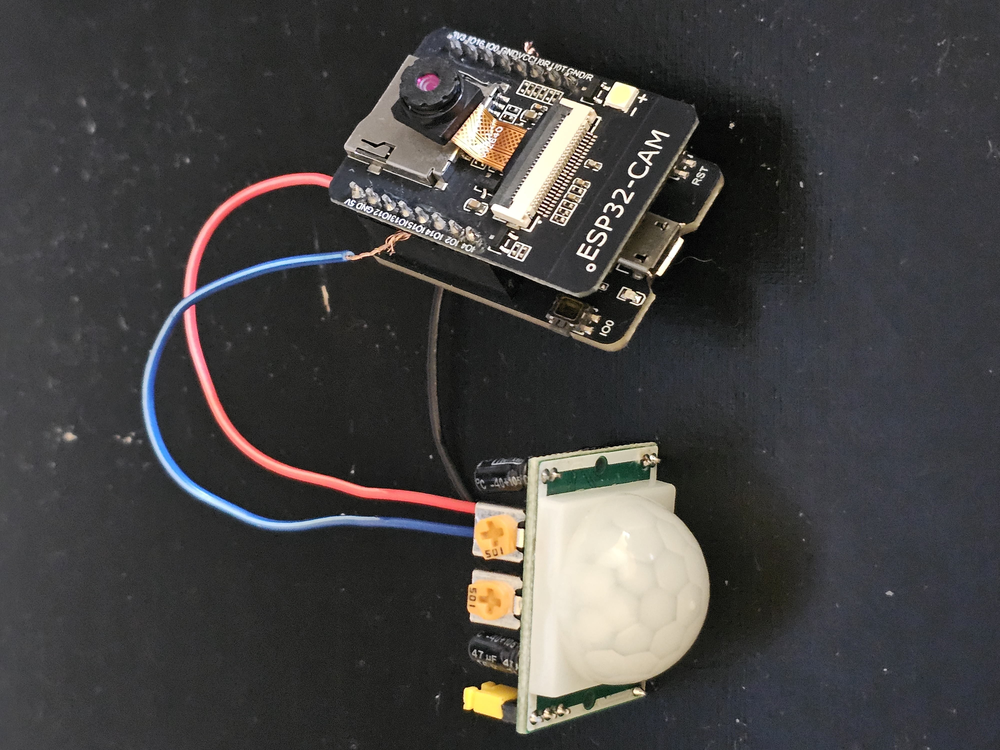
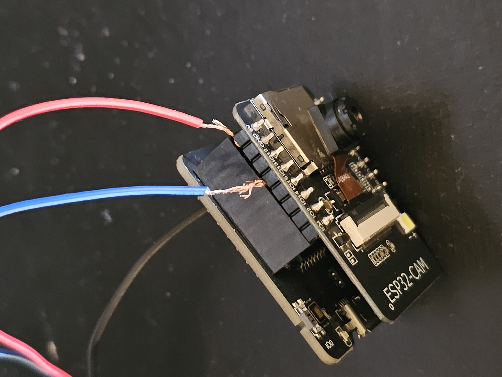
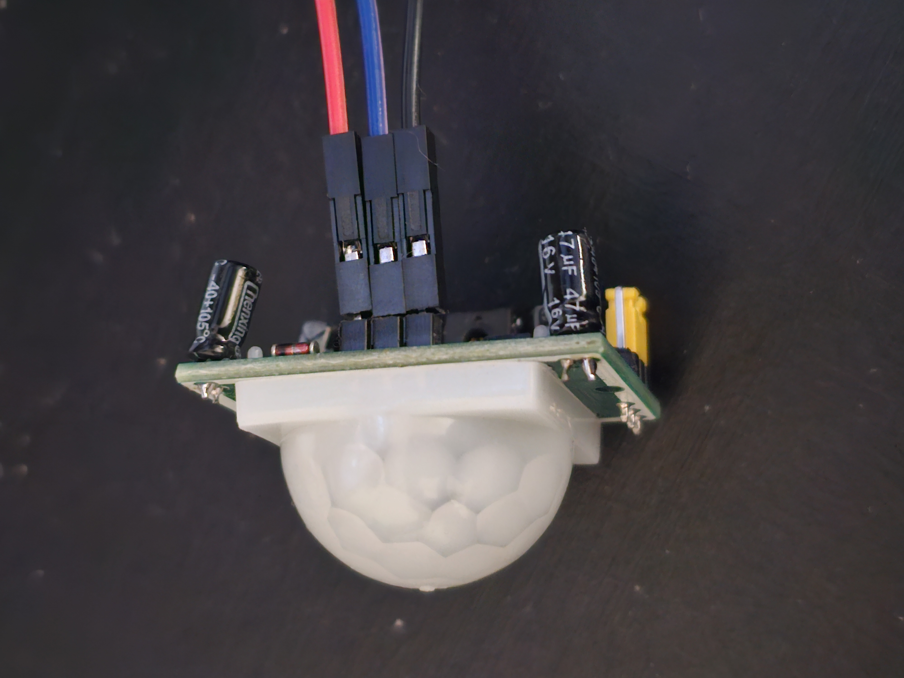

# Anotações & Progresso do Projeto

> [!NOTE]
> Aqui terá toda as informações de como foi desenvolvido o projeto IoT - Reconhecimento facial do meu TCC

[08/02/2026 - domingo]: Ontem (07/02/2026) sábado chegou o último dispositivo, o ESP32-CAM. hoje vamos dar iniciativa nas pesquisas sobre todos os dispositivos para entender melhor para que serve e como devo conectá-los e programá-los.

**Padrão de perguntas para cada componente:**

1. Oque é?
2. Oque cada parte do componente é?
3. Para que serve? (sua utilidade):
4. Onde deve ser usado?
5. Quais outros componentes são compatíveis com (nome_dispositivo)?

**perguntas globais**

- Onde deve ser programado (IDE)?
- Posso ser usado outra linguagem e depois compilar para a original (exemplo de pythop para arduino)?

### O que fiz hoje

1. Encontrei um site para simular meus dipositivos chamado [wokwi.](https://wokwi.com/)
2. Entrei nesse [vídeo](https://www.youtube.com/watch?v=mdaM53qIYgk&t=78s) e segui o tutorial. (não compactua com o escopo do meu projeto)
3. Imagem do sensor pir

4. até o momento percebi que o meu MB serve para passar os codigos e vou fazer as conexão de tudo feito depois porem ainda não entendi como fazer isso, vou deixar para o próximo dia

horário do termino: 20:26

---

[09/02/2026 - segunda]:

1. Conectei o dispositivo ao PC (após 1 hora de tentativas).
2. Realizei o teste inicial na placa **ESP32-CAM-MB** subindo um código para alternar o LED embutido a cada 2 segundos.
3. Configurei o **ESP32-CAM** na rede local utilizando o exemplo `CameraWebServer`.
4. Obtive imagens em tempo real acessando o IP local do dispositivo.

---

[10/02/2026 - terça]:

### Resumo

Hoje, às 17:17, tive um resultado acima do esperado: consegui fazer com que o dispositivo capturasse uma foto ao detectar movimento pelo **sensor PIR** e a enviasse automaticamente para o **Telegram**, por meio do bot `SecurityHomeJX_bot` (criado também hoje).

> [!NOTE]
> Isso representa um grande avanço, pois antes eu já estava considerando comprar equipamentos adicionais para concluir o projeto sem passar pela etapa de prototipagem.

### O que fiz

1. Preparei 3 fios (vermelho, azul e preto), cortando uma das pontas de cada um para expor o cobre.
2. Conectei os fios ao **Sensor PIR** conforme a tabela abaixo.
3. Conectei a outra extremidade dos fios (lado intacto) ao **ESP32-CAM-MB**.
4. Criei o bot `SecurityHomeJX_bot` no Telegram para receber as fotos capturadas.

### Conexões

#### Sensor PIR → Fios

| Pino do Sensor |   Fio    |
| :------------: | :------: |
|   **_VCC_**    | Vermelho |
|   **_OUT_**    |   Azul   |
|   **_GND_**    |  Preto   |

#### ESP32-CAM-MB → Fios

| Pino da Placa |  Sinal (Fio)   |
| :-----------: | :------------: |
|   **_5V_**    | VCC (Vermelho) |
|   **_GND_**   |  GND (Preto)   |
| **_GPIO 13_** |   OUT (Azul)   |

> A montagem ficou no estilo "sanduíche" — uma gambiarra criativa com os componentes disponíveis. 🛠️

### Protótipo Final

|               Protótipo - Final                |      ESP32-CAM e ESP32-CAM-MB (adaptado)      |                 Sensor PIR (adaptado)                 |
| :--------------------------------------------: | :-------------------------------------------: | :---------------------------------------------------: |
|  |  |  |

---

[25/03/2026 - quarta]:
Oque foi feito?
- Modificação do artigo.
- Arquitetura (servidor/dispositivo).

Análise técnica para resolver algumas questões sobre os testes do **prototipo:***

1. **Alta latência:** Por que o HTTP está lento nos testes?
	1. O `HTTP` é um protocolo `"pesado"` para um ESP32. Para cada foto, ele precisa abrir uma conexão `TCP`, fazer a handshake `TLS` (se for `HTTPS`, como o `Telegram`), enviar cabeçalhos gigantes e depois fechar a conexão. Isso gera a latência que eu percebi. O Wi-Fi do ESP32 não é `"lento"` (suporta 802.11b/g/n), mas o processamento dessa pilha de rede consome muita **CPU** e **RAM**.
2. MQTT para Imagens: O "Pulo do Gato"
	1. O MQTT é muito mais rápido porque a conexão fica aberta. Quando o sensor PIR dispara, o ESP32 simplesmente joga os bytes da imagem no tópico, sem burocracia.
	2. **O desafio:** A biblioteca padrão `PubSubClient` (muito usada no Arduino) tem um buffer padrão de apenas 128 ou 256 bytes. Uma foto VGA tem cerca de 20KB a 30KB.
	3. **Solução:** Usar uma biblioteca mais moderna como a `AsyncMqttClient`.
3. Como o Python irar receber isso?
	1. No lado do servidor, usarei a biblioteca `paho-mqtt`. O fluxo é simples:
		1. O Python se conecta ao **Broker MQTT** (presisarei de um Mosquitto).
		2. Ele se "inscreve" no tópico (ex: sala/camera1).
		3. Quando a imagem chega, o `paho-mqtt` entrega um array de bytes (payload).
		4. O Python salva esses bytes como um arquivo `.jpg` ou os passa diretamente para o OpenCV/FaceNet.
4. Proposta de Ação (ATIKA Strategy)
	1. Antes de escrever mais no artigo, preciso validar o MVP (Minimum Viable Product).
	2. Preciso escrever um script python (Subscriber) para receber as imagens e as condigurações necessárias para o ESP32 conseguir enviar arquivos maiores que o padrão via MQTT.

	> [!NOTE]
> Preciso instalar um Broker MQTT (Mosquitto) no pc/servidor para ESP32 e o Python poderem conversar.

---